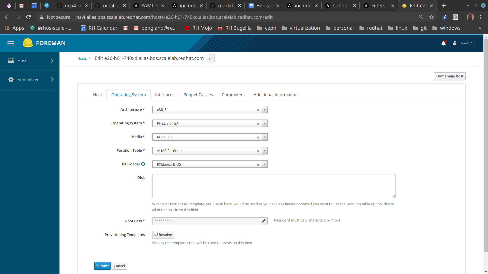
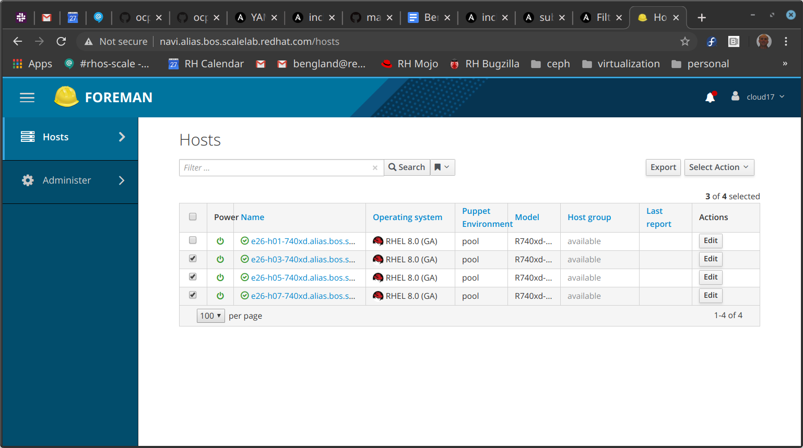

This repo contains 2 ansible playbooks for implementing Dustin Black's method for doing OpenShift 4 UPI installation 
on baremetal machines in the Red Hat (IBM) Perf & Scale Alias lab.   Dustin's document is [at this link](https://docs.google.com/document/d/1hl2qVWyRjqhKT3ZR5Q2xn9Ip1DLShanxQcnp11Zf1tw/edit?ts=5e5462d2#heading=h.f51z993ev25
).

# restrictions (at this time)

1) supports only 1 type of machine in a cluster
2) supports only Alias and maybe Scale Lab
3) supports only baremetal at this time (no clouds)
4) public interface is assumed to be slow
5) qinq-0 network configuration (each interface has separate VLAN)
6) RHEL8/Centos8 - RHEL7 not supported

I'm working on lifting restriction 1)

# where to run the playbook

You can run it from a host totally outside your cluster, or you can run it from the "deployer" = provisioning host.  If you do the latter, the playbook will be interrupted when it gets to the reboot, which is necessary as part of the upgrade of RHEL.   That's ok, just login after the reboot and restart the playbook, it should skip that set of tasks and move on from there.  It will discover that the block "upgrade to latest RHEL GA" has already been executed.

# discovery phase

The first step happens when you get your lab reservation.  At this time, 
we *require that RHEL8/Centos8 be installed on your deployer, masters and workers* - RHEL7 will not work.  This change can be done with Foreman GUI in Alias, for example.   Go into each host, use "Operating System" tab, fill it out like this:



Afterwards, you want your machines to look like this in Foreman:



You then rebuild them using the 'Select Action' button, you should get a dialog box like this one:


pull the playbooks and related files from github with:

```
# dnf install -y git ansible
# git clone https://github.com/bengland2/ocp4_upi_baremetal
# cd ocp4_upi_baremetal
```

After the RHEL8 rebuild completes, you can then discover information about your cluster using ansible fact-gathering.  You run the discover_macs.yml playbook one time, to generate an inventory file with mac addresses defined for all machines.   For example, construct an input inventory file like this one, call it **basic_inv.yml**:

```
[deployer]
e26-h01-740xd.alias.bos.scalelab.redhat.com

[masters]
e26-h03-740xd.alias.bos.scalelab.redhat.com
e26-h05-740xd.alias.bos.scalelab.redhat.com
e26-h07-740xd.alias.bos.scalelab.redhat.com

[workers]
e26-h09-740xd.alias.bos.scalelab.redhat.com
```

Then define your cluster parameters by doing:

```
cd group_vars
cp all.yml.sample all.yml
<edit all.yml>
cd ..
```

Next, ensure that you have password-less ssh access to all the machines in this inventory, using ssh-copy-id if this has not been set up already.  You may need to clear out ~/.ssh/known_hosts entries for previous incarnations of these hosts.  For example:

```
for h in $(grep scalelab basic_inv.yml) ; do echo $h ;  ssh-copy-id root@$h ; done
```

Now run the first playbook to get an output inventory file with mac addresses filled in.

```
ansible-playbook -vv --private-key ~/.ssh/id_rsa_perf -i basic_inv.yml discover_macs.yaml
```

This should output a file named **inventory_with_macs.yml** by default - it will look the same as your previous inventory but with per-host deploy_mac variable added to each record.   From now on, you use this as your inventory file, not the preceding one.

# deployment phase

At present the playbook relies on subscription manager to get RHEL8 repos that you need.   You need to do just one command on the deployer:

```
subscription-manager register
Username:your-account@redhat.com
Password:your-password
```

Now you set up your deployment with:

```
ansible-playbook -i inventory_with_macs.yml ocp4_upi_baremetal.yml
```

This playbook can be used whenever a re-install of the deployer host is needed, regardless of what state the masters and workers are in.

Dustin's document describes what the playbook should be doing.  This will take a long while, and may involve the reboot of the deployer host and download of RHCOS and openshift.   When it finishes, you will have a deployer host that is set up to install masters and workers.   We do not actually install the masters and workers in this playbook.   

To trigger the start of this process, use the installed **badfish.sh**.  It applies commands to a list of hosts in a file.  At present, it only supports the Dell 740xds in the Alias lab, but should work with most Dell machines.    See Dustin's notes about supermicro alternative procedures.   **badfish.sh** depends on the **QUADS_TICKET** environment variable defined in **~/.bashrc**  - you can source it or logout and login again.

```
cd
badfish.sh masters.list -t director
badfish.sh masters.list --check-boot
<keep doing this until you see "Current boot order is set to: director">
badfish.sh masters.list --pxe
badfish.sh masters.list --power-cycle
```

If all goes well, then the bootstrap VM should install CoreOS and ignition files on all of these machines and they should reboot and join the OpenShift cluster.  Once that has happened, you can then install the workers with the same procedure, substituting workers.list for masters.list.

When you are done with the cluster, use

```
for typ in masters workers ; do badfish.sh $typ.list -t foreman ; done
```

to revert the boot order to the original state that the labs expect.


# troubleshooting notes

To get a good log of the run so that others can see what happened, try adding this to end of your playbook command:

```
ansible-playbook ...  2>&1 | tee r.log
```

This playbook is designed to minimize repeated tasks by checking to see if a group of tasks are necessary or not - this feature is particularly nice when running the playbook from outside red hat (i.e. on your laptop from home).   This is somewhat problematic if the configuration changes and you re-run the playbook.   Look for tasks named "see if…"  and you can force the playbook to re-run those steps in most cases by just deleting some configuration file from the deployer host.  We can add a "force" option to make it skip this optimization later.

The slowest step in the installation procedure is download of RHCOS.  If you have to repetitively download the entire RHCOS directory (pointed to by rhcos_url in group_vars/all.yml), because of multiple sites or lab incarnations , then download to a local directory and then get it from there.   The rest of the playbook takes about 20 min to run, even from a remote laptop.


